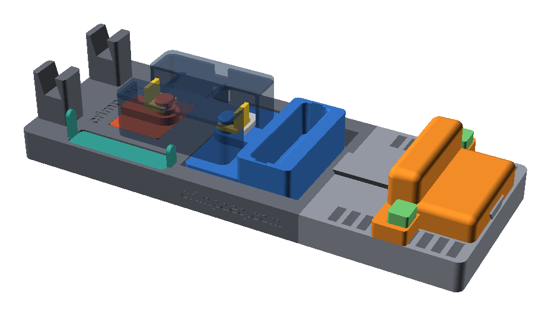

# Crimpdeq Hand Dynamometer



A parametric OpenSCAD platform that turns the [Crimpdeq](https://github.com/crimpdeq)
v2 portable force sensor into an isometric finger and hand dynamometer. The
closed Crimpdeq enclosure and its 50 kg load cell sit in a printed frame: one
load-cell eye is anchored to the frame, and the other is pulled by a
four-finger hangboard pocket while the palm pushes against a rounded wrist rest.
The wrist rest locks into one of nine hand openings with tool-free
ball-lock pins, and the enclosure itself never carries load.

The mechanism is inspired by the CC0
[Fingers of Fury hand dynamometer](https://makerworld.com/en/models/3148865-hand-dynamometer),
rebuilt natively in OpenSCAD. The project is standalone: it carries its own
simplified reference of the Crimpdeq case interface and does not need the
[crimpdeq-case](https://github.com/crimpdeq/crimpdeq-case) repository to preview,
export, or validate the model.

> [!CAUTION]
> This is an **unqualified prototype**, not a certified dynamometer or a device
> for suspending a person. The current build is an unloaded fit prototype for
> checking fit and comfort. Physical fit, comfort, and guarded load validation
> are still pending, and the sensor must never be loaded above its 50 kg rating.

## Documentation

The [book](docs/src/SUMMARY.md) covers the design and its structural
assumptions, a step-by-step guide to printing and assembling the fit prototype
on a 256 mm printer, the requirements for a future loaded version, and the
development workflow. Build it locally with [mdBook](https://rust-lang.github.io/mdBook/):

```bash
mdbook serve docs
```

## Quick start

Open the assembly preview, or export a part by name:

```bash
openscad dynamometer_assembly.scad
openscad -D 'part="grip"' -o /tmp/dynamometer_grip.stl dynamometer_assembly.scad
```

Validate the geometry after any change to the model:

```bash
CHECK_JOBS=4 OPENSCAD_RENDER_FN=24 bash check-collisions.sh
```

## License

This repository is source-available under the
[Crimpdeq Non-Commercial Hardware License](LICENSE). You may study, modify,
and build the design for personal, educational, and research use, and share
modified versions non-commercially. Commercial manufacture or sale of printed
parts, kits, or assembled devices requires prior written permission.
