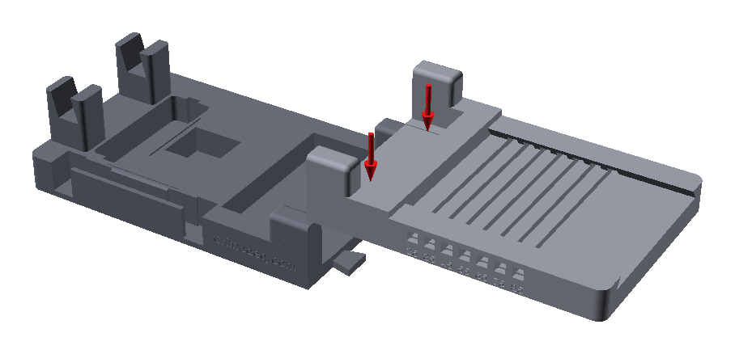
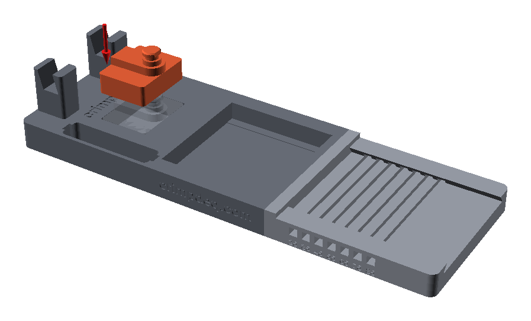
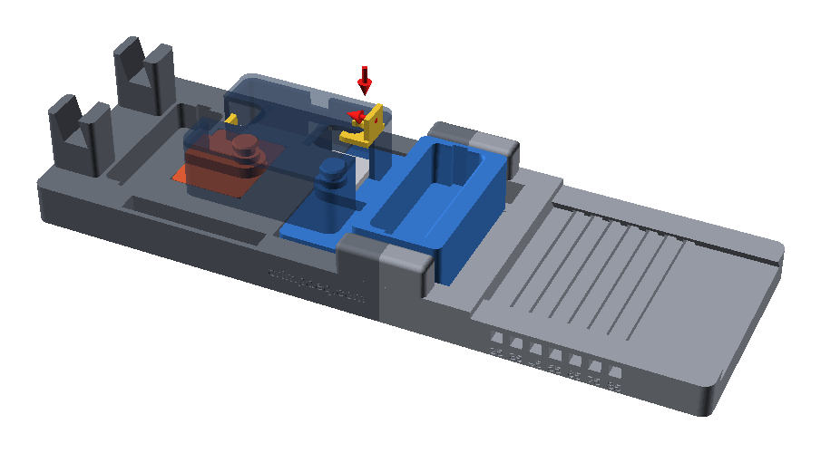
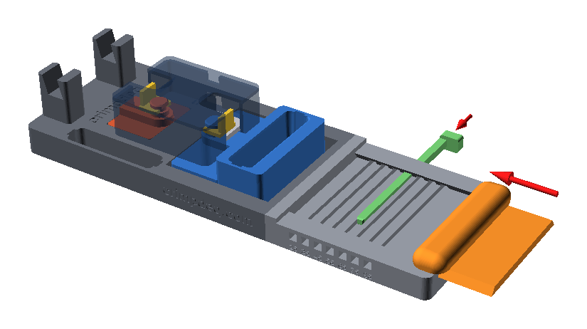
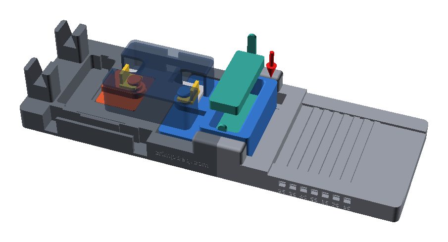
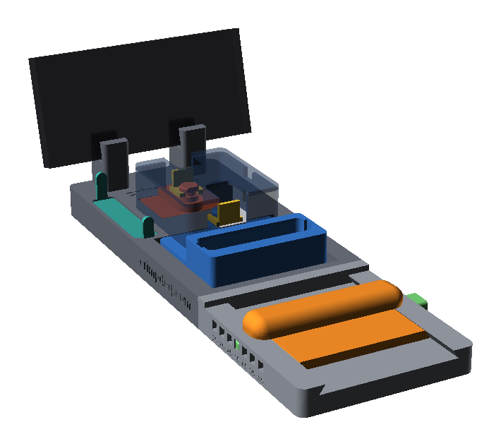

# Assembly

## 1. Join the base halves

Lower the rear half straight down onto the front half's two dovetail
tongues until both halves stand flat on the table.

## 2. Fit the anchor block

Drop the anchor block into its pocket at the outer end of the front half,
lug toward the middle.

## 3. Fit the grip and the case

1. Drop the grip into its trench, lug toward the anchor block.
2. Hold the Crimpdeq case lid up, with the switch and USB port facing the
   open side of the base.
3. Lower it so the anchor block's lug enters the load-cell eye at the left
   end. Slide the grip until its lug lines up with the right end, then let
   the case down.

The case must not touch the deck or any printed part; only the load cell
rests on the lugs.

The grip must hang free on the load cell: a strip of paper slides between
each guide ledge and the grip's side walls. If the grip rests on a ledge,
friction there takes part of the pull and the Crimpdeq reads low.

## 4. Fit the clips

For each lug, drop a clip flat into the slot in the case end beside the lug,
then push it in by its fin until it snaps round the lug's neck.

To remove the case, pull both clips out by their fins and lift it straight
up.

## 5. Fit the palm rest

Slide the palm rest into the channel from the rear end, bolster toward the
grip, with the bolster's wings resting on the deck on both sides. Push the
key, tip first, into the side of the base, through the groove under the
bolster, until its head meets the base. It fits from either side, with its
head pointing away from the grip.

The seven key holes along each side set the opening between the finger lip
and the palm face: 25 to 85 mm in 10 mm steps, engraved under each hole and
read below the key's head. To
change it, pull the key out by its head, slide the rest until its groove
lines up with the new hole, and push the key in again.

## 6. Stoppers and phone

The pocket gives a 25 mm edge on its own. Drop a stopper onto its floor, pull
tab in the end slot, for a shallower edge:

| Edge | Stoppers |
|---|---|
| 25 mm | none |
| 20 mm | 5 mm |
| 15 mm | 10 mm |
| 10 mm | both, tabs at opposite ends |

Store unused stoppers in the well beside the case.

Stand your phone in the slot at the far end of the base, in portrait or
landscape. It takes phones up to about 13 mm thick in their case.

Tare the Crimpdeq unloaded before measuring.
