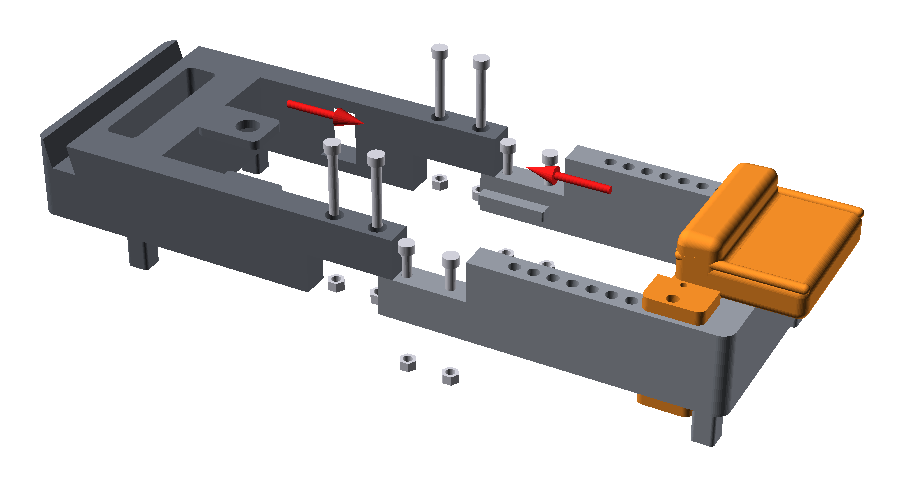
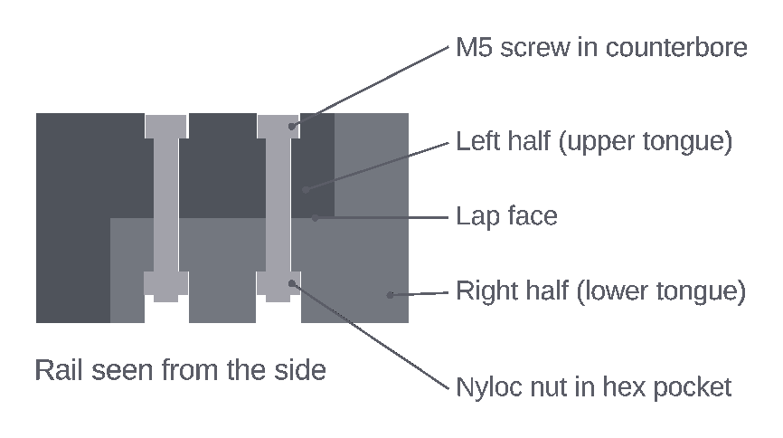

# Frame and wrist rest

> [!WARNING]
> **Order matters.** The wrist rest's arms wrap around both rails. Once the
> halves are bolted together the frame forms a closed loop, so the wrist rest
> can only go on **before** joining them, slid in from the lap end of the
> right half.

## Slide the wrist rest onto the right half

1. Put the right half (the one with the index holes) feet down, with the lap
   end towards you. Its only two feet are at the palm-post end, so prop the lap
   end on something about 19 mm high, such as a book, to keep it level.
2. Hold the wrist rest palm-surface up, with the heel deck pointing away from
   you, towards the palm post.
3. Line up the arms: the upper arms go **over** the rails, the lower arms
   **under** them.
4. Slide the rest along the rails, away from the lap end, until it's past the
   middle of the index-hole row. The upright palm face passes between the
   two grip-guide ledges on the rail inner faces.
5. Check that it slides freely over the whole row of index holes and that
   the heel deck passes over the palm post.

## Bolt the halves together

Each rail has a 48 mm half-lap. The left half keeps the upper half of the
rail depth, the right half the lower half. Two M5 screws clamp each lap. Their
heads sit in counterbores in the top face, and nyloc nuts sit in hex pockets
in the bottom face.

1. Push the wrist rest towards the palm-post end, away from the lap.
2. Stand both halves on their feet on a flat table, propping each lap end as
   before.
3. Lower the left half's upper tongues onto the right half's lower tongues.
   Both lap shoulders should close with no gap, and the rail tops should
   line up.
4. Push an M5 nyloc nut into the mouth of each hex pocket from below, nylon
   ring facing down, and hold it there with a finger or a piece of tape.
5. Insert an M5 × 35 screw from the top into each hole. Its tip reaches the
   held nut; turn it with a 4 mm hex key until it catches the thread.
6. Tighten each screw until its head seats and the lap faces are closed. The
   screw draws the nut up into its pocket. Don't over-tighten: the head bears
   on printed plastic.
7. Check that all four feet touch the table without rocking and that the
   rails are straight.
8. Slide the wrist rest along its full travel once to make sure it runs
   freely.

To take the frame apart again, remove the four screws and lift the left half
off the right half.
