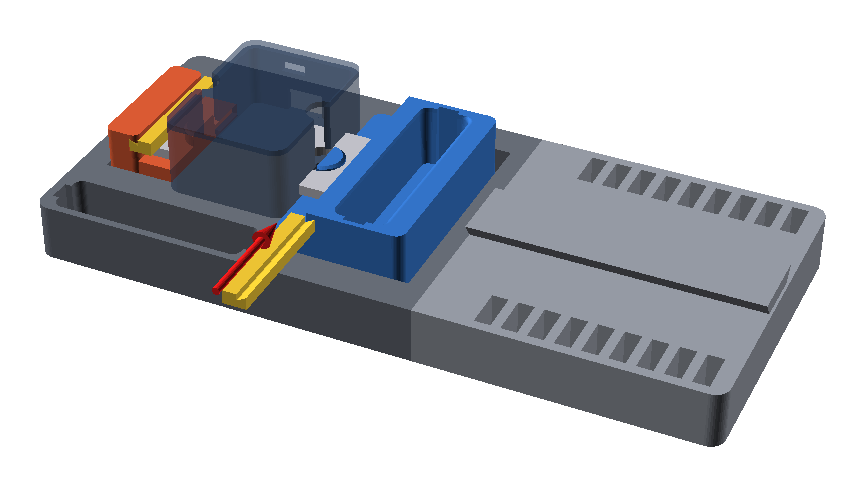

# Grip, case and keepers

## Place the grip and the case

1. Drop the grip into its trench, lug toward the anchor block. It rests on
   the two guide ledges.
2. Hold the Crimpdeq case lid up, with the switch and USB port facing the
   open side of the base, away from the stopper well.
3. Lower it so the load cell's left eye drops over the anchor block's lug.
   Slide the grip along its trench until the right eye lines up with the
   grip's lug, then let the case down.

Both ends of the load cell now lie flat on their seats, and the case floats
above the deck. It touches nothing but the two lugs and seats.

## Fit the keepers

Slide one keeper into the groove across the anchor block's end wall and the
other into the groove across the grip's end wall, flat face down, until each
is centred over its end of the load cell. They hold the load cell down on its
seats and keep the grip level.

## Check

- [ ] The case doesn't touch the deck, the anchor block or the grip. A sheet
      of paper slides under it.
- [ ] The grip's top is level. Note whether it hangs free or rests on the
      guide ledges.
- [ ] The switch and USB port are easy to reach.

To take the case out, slide both keepers out and lift it straight up.
