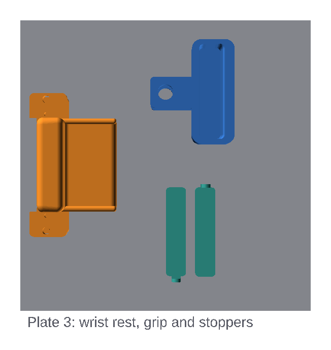

# Printing

## Files

Download the STL files from the latest
[release](https://github.com/crimpdeq/crimpdeq-platform/releases), or export
them into `exports/` from the repository root (this takes a few minutes):

```bash
bash export-parts.sh
```

Use files from a single release or export; parts from different versions may
not fit together.

| File | Contents | Plate |
|---|---|---|
| `crimpdeq-platform-frame_left.stl` | Left frame half (fixed clevis, stopper well, phone slot, USB window, upper lap tongues) | 1 |
| `crimpdeq-platform-frame_right.stl` | Right frame half (index holes, grip guides, palm post, lower lap tongues) | 2 |
| `crimpdeq-platform-wrist_rest.stl` | Wrist rest with palm bolster | 3 |
| `crimpdeq-platform-grip.stl` | Finger grip | 3 |
| `crimpdeq-platform-stoppers.stl` | Two stackable pocket stoppers, 5 and 10 mm thick | 3 |

> [!NOTE]
> The frame comes as two halves because the full frame is 343.9 mm long and
> does not fit a 256 mm bed, even diagonally. The left half is 210.1 mm long
> and the right half 181.8 mm. Both are 124 mm wide, too wide to share a
> plate, so each gets its own.

All parts are exported already oriented for printing. Don't rotate them or
use "Lay on face".

## Plates 1 and 2: frame halves


- One frame half per plate, centred, with the long sides along Y.
- Both halves print upside down: the flat rail faces on the bed and the feet
  pointing up. The stopper well and phone slot of the left half open onto
  the bed.

## Plate 3: wrist rest, grip and stoppers



Keep the parts at least 15–20 mm apart. **Print Plate 3 first.** It's
shorter, and it lets you check support removal before the long frame prints.

## Print settings

Use one global process profile, then override per object where listed.

| Setting | Value |
|---|---|
| Layer height | 0.2 mm |
| Walls | 6 |
| Top/bottom layers | 6 |
| Infill | 40–60% for the frame halves |
| Supports | On, **Global**, type **tree(auto)**, threshold 30° |
| On build plate only | **Off** (the grip cheek needs support from the part) |
| Brim | Outer brim only, 5 mm |

Per-object override (select the object, switch Process to **Objects**):

| Object | Override |
|---|---|
| `grip`, `wrist_rest`, `stoppers` | 100% infill |

PETG or ASA print well on the A1 and are enough to check fit and comfort.
PA-CF or PET-CF may be candidates for structural evaluation, but a filament
name or infill setting does not establish strength. Validate coupons in the
intended print orientation.

## Where supports are needed

| Part | Supported area |
|---|---|
| Right frame half | Underside of both lap tongues, about 22.5 mm up |
| Right frame half | Grip-guide ledges on the rail inner faces, about 31 mm up |
| Right frame half | Bridge over the palm-deck channel at the closed end |
| Left frame half | Clevis cheek with the Ø12.9 mm sleeve hole, about 35–45 mm up |
| Wrist rest | Underside of the overhanging heel deck and outer upper arms |
| Grip | Underside of the upper clevis cheek and pocket body |

Nothing else needs support: the index holes are self-supporting, the screw
counterbores, stopper well and phone slot of the left half bridge over their
openings, the nut pockets of the right half open upwards, and the stoppers
print flat with their pull tabs standing upright.

The right half's lap faces bear the rail load. Remove their support
carefully and sand them flat, without rounding the edges. The grip rests on
the top faces of the guide ledges: sand those smooth and flat too. The wrist
rest's upper arms slide just above the rail tops and its lower arms just
below them, so sand support scars on those faces flat as well.
