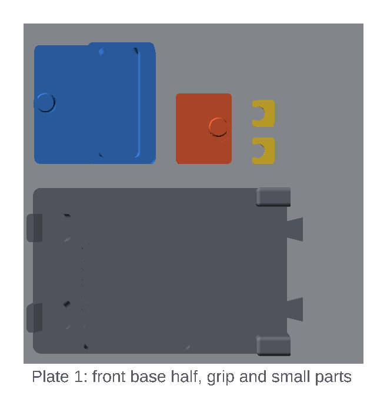
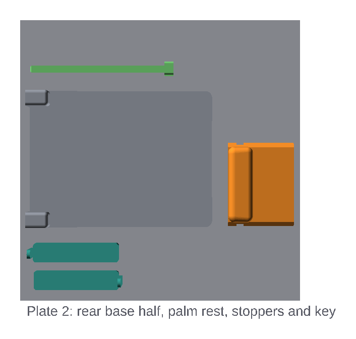

# Printing

## Files

Download the STL files from the latest
[release](https://github.com/crimpdeq/crimpdeq-platform/releases), or export
them into `exports/` from the repository root:

```bash
bash export-parts.sh
```

Use files from a single release or export; parts from different versions may
not fit together.

| File | Contents | Plate |
|---|---|---|
| `crimpdeq-platform-base_front.stl` | Front base half: phone stand, anchor pocket, stopper well, grip trench, joint tongues | 1 |
| `crimpdeq-platform-grip.stl` | Finger grip with its eye lug | 1 |
| `crimpdeq-platform-anchor.stl` | Anchor block with its eye lug | 1 |
| `crimpdeq-platform-clips.stl` | Two identical eye clips | 1 |
| `crimpdeq-platform-keys.stl` | Two identical index keys, printed on their sides | 1 |
| `crimpdeq-platform-stoppers.stl` | Two stackable pocket stoppers, 5 and 10 mm thick | 2 |
| `crimpdeq-platform-base_rear.stl` | Rear base half: rest rail, key slots, joint sockets | 2 |
| `crimpdeq-platform-rest.stl` | Palm rest | 2 |

> [!NOTE]
> The base comes as two halves because it is 331 mm long and does not fit a
> 256 mm bed, even diagonally. The front half is 230 mm long and the rear
> half 112 mm; both are 122 mm wide. The phone stand makes the front half
> 60 mm tall at one end, the tallest part on the plates.

All parts are exported already oriented for printing. Don't rotate them or
use "Lay on face". The keys print on their sides on purpose: they are then
sheared along their layers instead of between them.

## Ready-made Bambu Studio project

Each release also includes `crimpdeq-platform.3mf`, a Bambu Studio project
with both plates already laid out and the [print settings](#print-settings)
applied, including the per-part infill. It's set up for a Bambu Lab A1 with
a 0.4 mm nozzle, Generic PETG, and the textured PEI plate. It takes about
680 g of PETG.

1. Open it with **File → Open Project**.
2. Select your printer, filament and plate. Changing the printer can reset
   process settings, so compare them with the tables below afterwards.
3. Do the [slicer checks](slicer-checks.md) before printing.

## Plate 1: front base half, grip and small parts



## Plate 2: rear base half, palm rest and stoppers



Keep the parts at least 15 mm apart.

## Print settings

Use one global process profile, then override per object where listed.

| Setting | Value |
|---|---|
| Layer height | 0.2 mm |
| Walls | 6 |
| Top/bottom layers | 6 |
| Infill | 20% |
| Supports | **Off** |
| Brim | Outer brim only, 5 mm |

Per-object override (select the object, switch Process to **Objects**):

| Object | Override |
|---|---|
| `grip`, `anchor`, `clips`, `keys` | 100% infill |
| `rest` | 50% infill |
| `base_front`, `base_rear` | 4 top and 4 bottom layers |

Height ranges print the lightly loaded parts of three objects sparser.
Right-click the object, choose **Height range Modifier**, set the range, and
give it the listed infill:

| Object | Range | Infill | Covers |
|---|---|---|---|
| `base_front` | 22.6–59.6 mm | 10% | The phone stand's cheeks, the only part above the deck |
| `rest` | 11–29.5 mm | 15% | The upper heel and the bolster, above the key wings and rail groove |
| `anchor` | 0–11.5 mm | 40% | The lower body in the pocket, below its solid top 5 mm |

The lugs must be solid: the load cell's eyes bear on them directly, and the
anchor block stays solid for 5 mm under its tongue root. The anchor's lower
body only bears on its pocket. The base halves and palm rest can be sparse because the six walls print their
loaded features solid: the key slots and the ligaments between them, the
rail, the joints, the anchor pocket and the rest's key wings. Don't reduce
the walls, or the top and bottom layers below these values. The stoppers
are outside the load path. If the base's top surfaces show the infill
through them, go back to 5 top layers.

PETG prints well on the A1 and is what the structural screens assume, but a
filament name or infill setting does not establish strength. Validate
coupons in the intended print orientation.

## Supports

No part needs support, so supports are off. The base halves print flat with
every slot, pocket, trench and well open upward; the rear half's joint
sockets (12 mm) and the palm rest's rail groove (25 mm) are closed by
bridges. The anchor block and grip print upright with their lugs on top;
the flat ring under each lug head is only 1.9 mm wide. The clips print flat on
their clamp faces with their fins up, the keys stand on their sides, and the
stoppers print flat with their pull tabs upright.

Don't turn supports on: support in the rail groove would scar a sliding face,
and support round a lug would scar the side the load-cell eye bears on.
