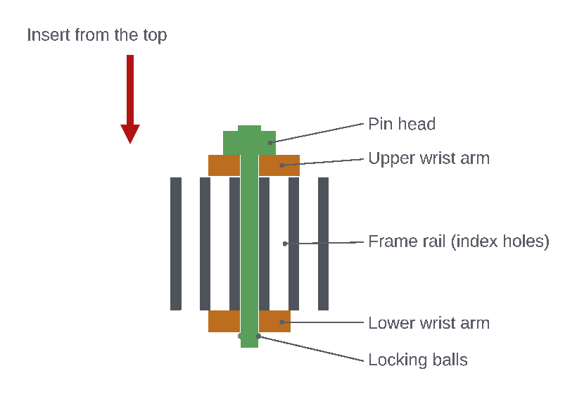
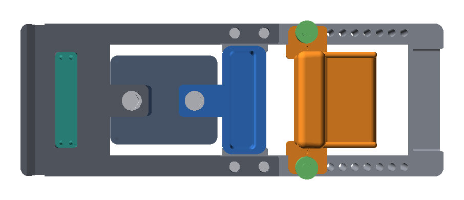
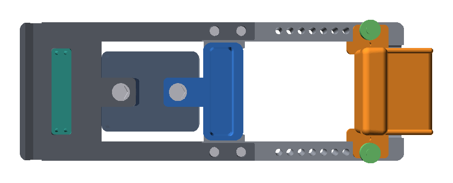

# Wrist pins and hand positions

## Fit the wrist pins

1. Line up the wrist rest's arm holes with one index hole on each rail. Start
   with the middle (5th) hole.
2. Press the pin's button and push the pin down from the top through the
   upper arm, the rail and the lower arm, until the head rests on the upper
   arm. Release the button. The head sits beside the bolster, below its
   top.
3. Check that both locking balls stand out fully below the lower arm, then
   tug the pin to confirm that it is locked.
4. Tie each pin's lanyard to the Ø3.5 mm anchor hole next to it on the wrist
   pad.

## Change position

1. Fully unload the device.
2. Press each pin's release button and pull both pins by hand.
3. Slide the wrist rest to the new index hole on both rails.
4. Reinsert both pins and tug-test them.

Always use the same index hole on both rails, and never load the device
unless both pins are fully locked.

## The nine positions

The opening is measured from the outside of the finger-pocket lip to the palm
face of the wrist rest. The hole nearest the grip gives 25 mm, and each hole
further away adds 10 mm, up to 105 mm.

**Smallest opening: 25 mm (hole 1)**

**Largest opening: 105 mm (hole 9)**

| Hole | Opening | Starting point for |
|---|---|---|
| 1–3 | 25, 35, 45 mm | Full crimp or smaller hands |
| 4–6 | 55, 65, 75 mm | Half crimp |
| 7–9 | 85, 95, 105 mm | Extended fingers or larger hands |

These are starting points, not fixed recommendations. Try each one.
