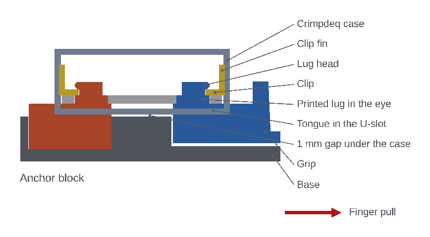

# Design

The device is isometric and fully printed. It holds the
[crimpdeq-case v2.0.0](https://github.com/crimpdeq/crimpdeq-case/tree/v2.0.0)
enclosure, which lies flat, lid up, in the middle of a printed base. The
case encloses the whole load cell. Each Ø17 mm eye is reached through a
vertical U-slot, Ø22 mm round the eye and open to the case end, through the
full height of the case. Printed lugs rise through those slots into the eyes:

- the **anchor block** holds the left eye and bears on the base
- the **finger grip** holds the right eye and carries the hangboard pocket

When the fingers pull the grip toward the palm (+X), the outer rim of each
eye presses on its lug. The force passes from the grip, through the load
cell, into the anchor block, and from there through the base to the palm
rest. It never passes through the case: the case floats 1 mm above the deck
and the printed parts keep at least 1 mm from it. Its shell, lid and screws
carry no load.

## Eye lugs

A narrow tongue rises from the anchor block and from the grip through each
U-slot, keeping 1 mm from the case, up to the load cell's underside. The load
cell rests on the tongues. On each tongue, a round lug fills the eye with
0.25 mm clearance, and the eye bears on it across its full 16.5 mm diameter
and the load cell's 4 mm thickness.

Above the load cell the lug narrows to a Ø11 mm neck, then widens to a head
no wider than the lug, with a 1 mm lead-in chamfer on top, so the eye still
drops over it. The head's underside is a 2 mm-wide flat ring for the clip,
then a short printable chamfer. The head is cut flat on its inboard side,
1 mm clear of the battery walls that the case lid drops into the inboard edge
of each U-slot. Only the outboard side of the lug carries the pull.

The anchor block and the grip print upright. The lug is short and round, so
even loaded across the layers its root stays at 4.4 MPa bending at the design
target.

## Eye clips

Two identical printed clips hold the load cell down on its tongues, under the
lug heads, so the grip hangs from the load cell. Each clip is a flat fork
that lies on the load cell round a lug's neck, with a fin at its outboard end.
It drops into the U-slot beside the lug, then slides in until its fork snaps
round the neck: the fork's mouth is 0.3 mm narrower than the neck on each
side. The head stops it lifting and the snap stops it sliding out. The
clips don't carry the pull, but they do carry the grip's tilt: they hold the
load cell against the moment of an off-centre finger pull, bearing on the
flat ring under each lug head. The grip-side clip's fin has 6 mm of finger
room beside the grip while it is fitted. Pulling the fins releases the clips
and frees the case.

## Finger pocket

The pocket has an 80 × 20 mm opening and is exactly 25 mm deep. Its walls
have a 1 mm draft and rounded corners, leaving 78 × 18 mm at the floor. A
2 mm radius rolls the loaded +X edge, and the lip keeps at least 10 mm of
material behind it. Fingers enter from +Z and pull toward the palm rest.

The pocket is set low: its top is 11 mm above the load cell's underside and
its floor 14 mm below it. The middle of each edge then sits within 4 mm of
the load-cell plane, from −3.5 mm for the 25 mm edge to +4 mm for the 10 mm
edge. This keeps the finger pull nearly in line with the load cell and
limits the tilt it causes.

## Pocket stoppers

Two drop-in stoppers, 5 and 10 mm thick, raise the pocket floor. On their
own they give 20 and 15 mm edges; stacked, in either order, they give a
10 mm edge. Without a stopper the edge is 25 mm. Each is a 17.5 × 77.5 mm
plate that fits the pocket floor with 0.25 mm clearance, so the pocket walls
locate it. The fingers press it onto the floor or onto the stopper below.

Each stopper has a 3 × 8 mm pull tab on one end face: the 5 mm stopper at one
end, the 10 mm stopper at the other. The tabs run in slots in the pocket end
walls, so the whole top of the stopper stays free for the fingers. With a
stopper on the pocket floor, its tab stands 6 mm above the grip.

When not in use, the stoppers stack in a 16 mm-deep well in the deck, on the
−Y side next to the case.

## Phone stand

A 37 mm-tall stand across the far (−X) end of the base holds a phone running
the Crimpdeq app. Its slot floor is at Z = 15 mm, 13 mm below the top of the
case and about 40 mm behind it, so the case only hides the bottom of the phone
when seen from less than 18° above the table. The slot is 14 mm wide, for a
phone up to about 13 mm thick in its case, and 16 mm deep with a flat floor.
It leans 15° away from the user, so the screen faces the hand, and is open at
both sides, so a phone fits in portrait or landscape. The stand is two
20 mm-wide slotted cheeks, 84 mm across overall. The phone spans the 44 mm
gap between them, which saves filament and leaves room for a charging
cable in portrait; a phone 64 mm wide still rests 10 mm on each cheek. The
stand sits beyond the anchor block, with 6 mm of finger room before the
stopper well. It is away from the hand and the grip, and carries no load.

## Grip guides

The grip hangs from the load cell and does not touch the base. Its trench
leaves it 8 mm of free travel in the pull direction, 1 mm behind and 3 mm at
each side. Pulling takes up at most about 1 mm of that: the lug's clearance
in the eye, the anchor block's play in its pocket and the load cell's
stretch. Two ledges run under the grip's side walls, 1 mm below them, enough
to absorb print tolerances so the grip doesn't rest on them. If the
grip tilts, they catch it and keep its top level, but they leave it free
along X. They only touch the grip once it has dropped onto them, and friction
there then affects readings; see
[Known limits](../build/checks-and-limits.md#known-limits).

## Palm rest and hand positions

The palm rest is one solid part: an upright palm face, a 60 × 78 mm heel deck
level with the top of the finger pocket, and a straight palm bolster along the
finger-facing edge. The bolster is 22 mm deep and rises 20 mm above the
deck, with rolled 6 and 5 mm top edges. Its −X face continues the palm
face. There are no holes, slots or fasteners in the contact area.

The rest slides on a dovetail rail along the middle of the rear base half.
The rail holds it down and sideways, so pushing on the bolster cannot tip it
off. Two printed index keys lock its position. Each key drops through a slot
in one of the rest's side wings, outside the palm area, into one of nine
slots in the deck. The nine positions set the hand opening from 25 to 105 mm
in 10 mm steps. The opening is the clear gap from the outside of the finger
lip to the palm face. Adjustment needs no tools: lift both keys out, slide the
rest, and drop them in again.

Approximate starting points are 25–45 mm for full crimp or smaller hands,
55–75 mm for half crimp, and 85–105 mm for extended fingers or larger hands.
These are setup guides, not ergonomic prescriptions.

## Base

The base is 331 mm long, 122 mm wide and 22.6 mm tall below the deck, so it
is printed as two halves that each fit a 256 mm bed: a 230 mm front half
with the phone stand, anchor pocket, stopper well and grip trench, and a
112 mm rear half with the rail and key slots. Two vertical dovetail tongues on the front half
drop into sockets in the rear half. Under load the anchor pushes the front
half toward the rest and the rest pushes the rear half back, so the butt
faces of the joint are in compression. The dovetails only keep the halves
aligned and together when the platform is carried.

The switch and USB port face +Y. Nothing stands above the deck on that side:
a 30 mm-wide corridor in front of both openings stays clear out past the
base edge.
