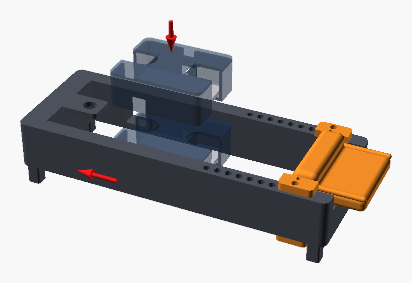
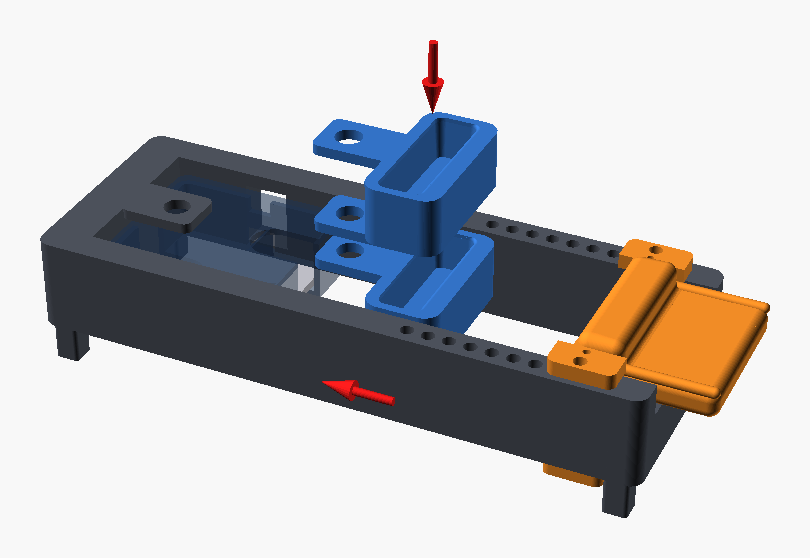
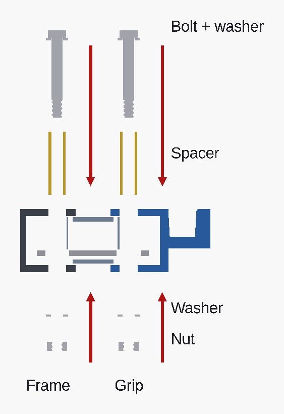
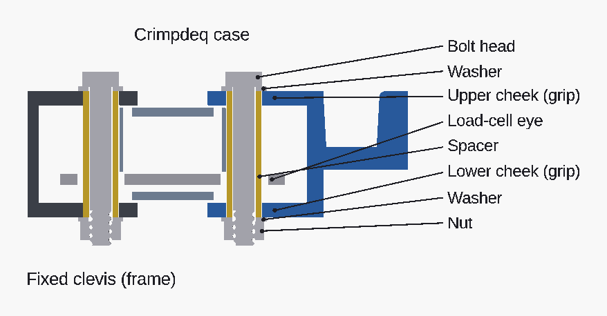

# Case, grip and bolts

Push the wrist rest to the palm-post end before starting. That leaves room to
lower the case and grip into the frame.

> [!NOTE]
> The frame has no floor. The case only stays in place once the bolts are in,
> so hold it by hand or rest it on a block about 24 mm high on the table. The
> grip rests on the pads on top of the two seam-brace posts.

## Case into the frame

1. Close the case with its own M2.5 screws. These screws carry no load.
2. Turn the case so the USB port and switch face the window in the side rail.
3. Lower the case straight down into the frame, to the right of the fixed
   clevis (the pair of plates with a hole at the left end).
4. Slide the case left until its left eye sits between the clevis plates and
   lines up with their holes.

The case must not rub on the frame. There's about 1 mm clearance to each
clevis plate.

## Finger grip

1. Hold the grip with the finger pocket facing up.
2. Lower it into the frame just to the right of the case until it sits on
   the two brace pads. Its top is then level with the frame top, and its two
   plates (cheeks) sit at the height of the case's top and bottom.
3. Slide it left along the pads so the cheeks go over and under the right end
   of the case, until the cheek holes line up with the right eye.

## Spacers, bolts, washers and nuts

Do this for both joints, the fixed clevis on the left and the grip on the
right. Keep the frame standing on its feet, so the bolt heads end up on top
and the nuts underneath.

1. Push a printed spacer down through the upper cheek, the case, the
   load-cell eye and the lower cheek. It should end flush with both cheek faces.
   The spacer is thinner than the eye and sits loose in it. That's expected:
   the fit prototype has no collars, which only the metal loaded version uses.
2. Put a washer under the bolt head and push the bolt down through the spacer
   from the top.
3. Tip the frame onto its side or reach underneath. Put the second washer on
   the bolt tip and screw the nut on **clockwise, by hand**.
4. Tighten with your fingers until the washers just touch the cheeks.

> [!WARNING]
> Tighten with your fingers only, never a wrench. The printed thread strips, and
> extra tension pulls the cheeks into the case.

## Check the joints

- [ ] About 2 mm of thread shows below each nut.
- [ ] The grip can move a little along the frame without the case touching the
      grip or the frame walls.
- [ ] The USB port and switch are reachable through the side-rail window.
- [ ] On a flat table only the four feet touch. The nuts stay clear.
