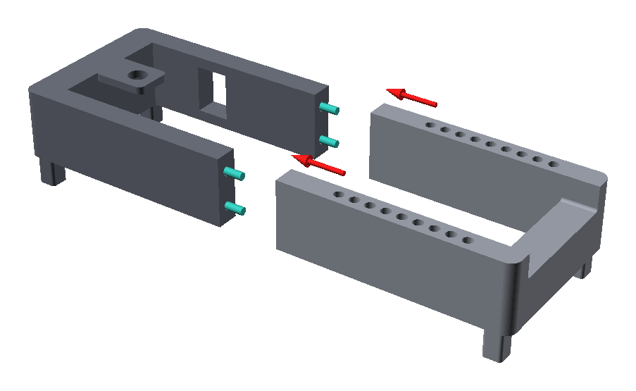
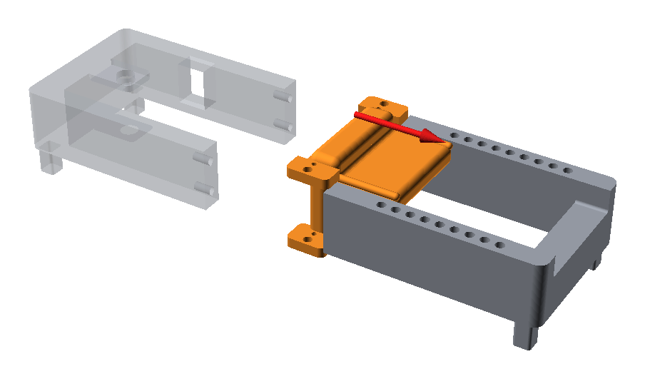
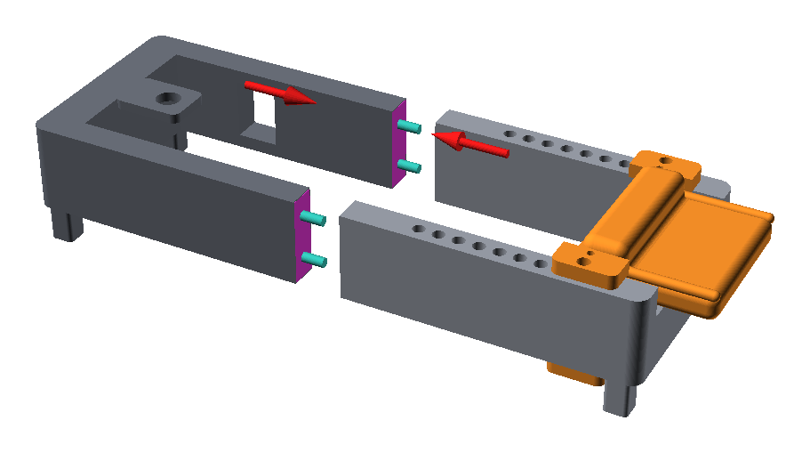
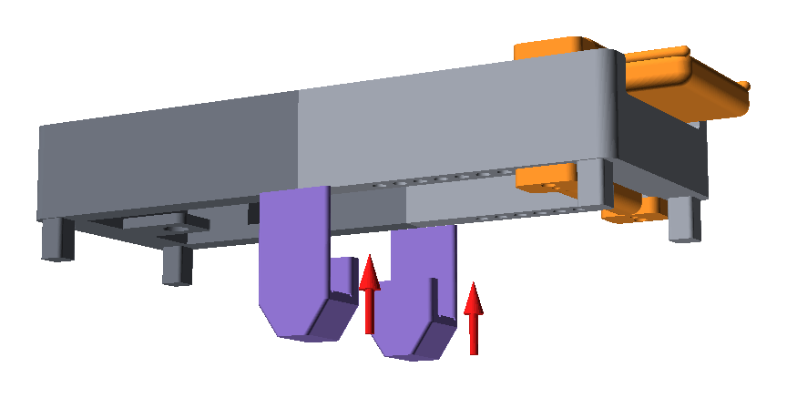

# Frame and wrist rest

> [!WARNING]
> **Order matters.** The wrist rest's arms wrap around both rails. Once the
> frame is glued it forms a closed loop, so the wrist rest can only go on
> **before** gluing, slid in from the cut end of the right half.

## Dry-fit the halves

1. Press the four pegs into the bores of the left half, two per rail.
2. Push the right half on. The cut faces should close with no gap, and the
   rail tops and bottoms should line up.
3. Pull the halves apart again and leave the pegs in the left half.

## Slide the wrist rest onto the right half

1. Put the right half (the one with the index holes) feet down, with the cut
   face towards you. Its only two feet are at the palm-post end, so prop the
   cut end on something about 19 mm high, such as a book, to keep it level.
2. Hold the wrist rest palm-surface up, with the heel deck pointing away from
   you, towards the palm post.
3. Line up the arms: the upper arms go **over** the rails, the lower arms
   **under** them.
4. Slide the rest along the rails, away from the cut, until it's past the
   middle of the index-hole row.
5. Check that it slides freely over the whole row of index holes.

## Glue the frame

1. Push the wrist rest all the way to the palm-post end, or tape its arms, so
   squeezed-out glue can't reach it.
2. Put glue in the empty bores of the right half and a thin layer on both cut
   faces (magenta in the picture).
3. Join the halves on a flat table with the feet down. Press the ends together.
4. Check that all four feet (two per half) touch the table and the rails are straight.
5. Leave it to cure fully before handling: CA about 1 h, epoxy as the label says.
6. Slide the wrist rest along its full travel once to make sure it isn't glued.

## Glue the seam braces

Each rail gets one brace across its joint. The brace wraps the rail from
below like a U: a splint on the outer face, a slab under the rail and a post
on the inner face, all on a leg that stands on the table next to the feet.
The top of the inner post is a pad that later holds the finger grip level.

1. Keep the wrist rest pushed to the palm-post end.
2. Dry-fit each brace: lift the frame, push the brace up onto the rail joint
   from below so the rail sits in its channel, and set the frame back down.
   The joint line should be in the middle of the brace, with the inner post
   facing the inside of the frame and the leg's sole on the table.
3. Take the braces off. Put a thin layer of glue on the inside of the channel:
   the splint, the slab and the post.
4. Fit them again the same way, with the frame on its feet and both soles on
   the table. Wipe off squeezed-out glue, and keep glue off the top of the
   post, where the grip rests.
5. Let it cure fully, then check that the frame rests on all four feet and
   both brace legs without rocking.
