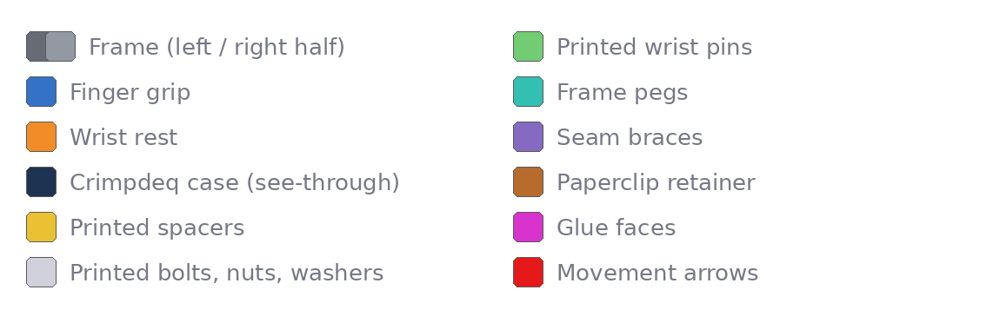

# Overview and safety

## What you are building

The dynamometer holds the Crimpdeq v2 case, with its 50 kg load cell, between
two supports:

- a **finger grip** (blue) with a hangboard-style pocket, bolted to the right
  load-cell eye
- a **wrist rest** (orange) with a palm bolster and heel deck, which slides
  along the frame rails and locks into one of nine positions

The **frame** (grey) holds the left load-cell eye in a fixed clevis. It is
printed as two halves, dark and light grey in the pictures, glued together
and reinforced by two **seam braces** (violet) under the rail joints. The
USB port and switch stay reachable through a window in the side rail.

## Colour key

The illustrations use the same colours throughout.

## What this prototype is for

Use it to check:

- that the parts print and fit together on a 256 mm printer
- that the real Crimpdeq case, load-cell eyes, USB port and switch fit
- how the palm bolster, heel deck and finger pocket feel in your hand
- which of the nine hand openings suit your grips
- whether the wrist pins are easy to reach and pull at every position

> [!CAUTION]
> **Do not pull on it, hang from it or lean on it.**
>
> - The frame is split into two glued halves so it fits the A1 bed. The glue
>   joint is not structural.
> - The bolts, nuts, wrist pins and spacers are printed stand-ins with no load
>   rating.
> - The full design has not been load-tested. A loaded version needs a one-piece
>   frame, steel hardware, machined inserts and a design fix (see
>   [Known limits](fit-trial-and-feedback.md#known-limits)).

## Overall workflow

1. Print Plate 2 (small parts), then Plate 1 (frame halves).
2. Bench-check the printed bolts, nuts, pins and pegs.
3. Slide the wrist rest onto the right frame half, glue the halves, then glue
   a seam brace across each rail joint.
4. Fit the case, grip, spacers and bolts.
5. Fit the wrist pins and try every hand position.
6. Record your fit and comfort feedback.
