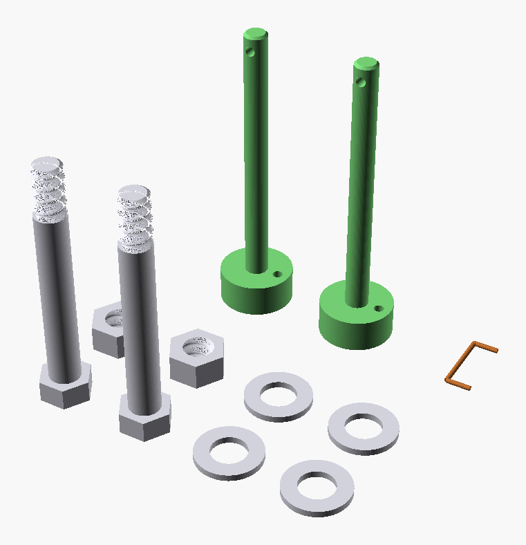

# What to print

## Files

The STL files are not committed. Export them into `exports/` from the
repository root (this takes a few minutes):

```bash
mkdir -p exports
for part in frame_left frame_right wrist_rest grip frame_split_pegs \
    frame_split_braces pin_spacer_pair fit_bolt_set fit_quick_pin_pair; do
  openscad -D "part=\"$part\"" \
    -o "exports/crimpdeq-dyno-$part.stl" dynamometer_assembly.scad
done
```

Re-export after pulling design changes; parts from different versions may not
fit together.

| File | Contents | Plate |
|---|---|---|
| `crimpdeq-dyno-frame_left.stl` | Left frame half (fixed clevis, USB window) | 1 |
| `crimpdeq-dyno-frame_right.stl` | Right frame half (index holes, palm post) | 1 |
| `crimpdeq-dyno-wrist_rest.stl` | Wrist rest with palm bolster | 2 |
| `crimpdeq-dyno-grip.stl` | Finger grip | 2 |
| `crimpdeq-dyno-frame_split_pegs.stl` | 4 alignment pegs | 2 |
| `crimpdeq-dyno-frame_split_braces.stl` | 2 seam braces with legs and grip pads, one per rail | 2 |
| `crimpdeq-dyno-pin_spacer_pair.stl` | 2 printed spacers (stand-ins for steel sleeves) | 2 |
| `crimpdeq-dyno-fit_bolt_set.stl` | 2 bolts, 2 nuts, 4 washers | 2 |
| `crimpdeq-dyno-fit_quick_pin_pair.stl` | 2 wrist pins | 2 |

> [!NOTE]
> The frame comes as two halves because the full frame is 297.6 mm long and
> does not fit a 256 mm bed.

All parts are exported already oriented for printing. Don't rotate them or
use "Lay on face".

## Plate 1: frame halves (about 7 h, about 210 g)


- Only the two frame halves, side by side with the long sides along Y.
- Leave about 15 mm between them. Don't nest one inside the other.
- Both halves print upside down: the flat rail faces on the bed and the feet
  pointing up.

## Plate 2: everything else (about 5–6 h)


- Back row: wrist rest and grip, at least 15–20 mm apart.
- Front: spacers, pegs, seam braces, bolt set and wrist pins.
- Keep at least 15 mm around every tall part: the wrist rest, grip, spacers,
  bolts and pins.

**Print Plate 2 first.** It's shorter, and it lets you test the pegs, bolts,
pins and support removal before the long frame print.

## Printed hardware



- The bolts and wrist pins stand head down. The nuts and washers lie flat.
- The printed thread only fits the printed nut; it isn't an M8 thread.
- The wrist pins don't lock. A paperclip through the cross-hole holds each
  one in place.

## Print settings

Use one global process profile, then override per object where listed.

| Setting | Value |
|---|---|
| Material | PLA (PETG also works) |
| Layer height | 0.2 mm |
| Walls | 2–3 |
| Infill | 15% |
| Supports | On, **Global**, type **tree(auto)**, threshold 30° |
| On build plate only | **Off** (the grip cheek needs support from the part) |
| Brim | Outer brim only, 5 mm |

Per-object overrides (select the object, switch Process to **Objects**):

| Object | Override |
|---|---|
| `pin_spacer_pair` | 100% infill, 4 walls |
| `frame_split_pegs` | 4 walls |
| `frame_split_braces` | 4 walls |
| `fit_bolt_set`, `fit_quick_pin_pair` | 100% infill or 4 walls |

Total filament for both plates is about 330 g.

## Where supports are needed

| Part | Supported area |
|---|---|
| Right frame half | Bridge over the palm-deck channel at the closed end |
| Left frame half | Clevis cheek with the Ø17 hole, about 35–45 mm up |
| Wrist rest | Underside of the overhanging heel deck and outer upper arms |
| Grip | Underside of the upper clevis cheek and pocket rim |

Nothing else needs support: the peg bores and index holes are
self-supporting, and the seam braces stand upright on their soles.
